# Git-Captain 🚢

<div align="center">
  
  
  **Modern, secure Node.js application for managing GitHub repositories at scale**
  
  [](https://nodejs.org/)
  [](LICENSE)
  [](#security-features)
</div>

---

## 🌟 Overview

Git-Captain is a powerful web application that simplifies managing multiple GitHub repositories simultaneously. Originally created to solve the pain of creating same-named branches across numerous repositories for GitFlow and TeamCity workflows, it has evolved into a comprehensive repository management tool.

**Perfect for teams working with microservices, multi-repo projects, or any scenario requiring coordinated repository operations.**

---

## ✨ Features

- 🌿 **Branch Management**: Create, search, and delete branches across multiple repositories
- 🔍 **Pull Request Discovery**: Find open pull requests by base branch
- 🔐 **Secure GitHub OAuth**: Seamless authentication with GitHub
- 🛡️ **Enterprise Security**: Rate limiting, CORS, input validation, security headers
- 📊 **Real-time Results**: Live feedback with detailed operation logs
- 🎯 **Batch Operations**: Select multiple repositories for simultaneous operations
- 📱 **Modern UI**: Clean, responsive interface with loading states

---

## 🚀 Quick Start

### Prerequisites
- **Node.js 18+** 
- **GitHub account** with repository access
- **SSL certificates** (for HTTPS)

### Installation

1. **Clone the repository**
   ```bash
   git clone https://github.com/ConfusedDeer/Git-Captain.git
   cd Git-Captain
   ```

2. **Install dependencies**
   ```bash
   npm install
   ```

3. **Configure environment** (see [Configuration](#configuration))

4. **Generate SSL certificates** (see [SSL Setup](#ssl-setup))

5. **Start the server**
   ```bash
   npm start
   ```

6. **Access the application**
   ```
   https://localhost:3000
   ```

---

## ⚙️ Configuration

### Environment Variables

Create a `.env` file in the `controllers` directory:

```env
# GitHub OAuth Configuration
client_id=your_github_client_id
client_secret=your_github_client_secret
GITHUB_ORG_NAME=your_organization_name

# Server Configuration
PORT=3000
GIT_PORT_ENDPOINT=https://your-domain.com

# SSL Certificate Paths
privateKeyPath=./theKey.key
certificatePath=./theCert.cert
```

### GitHub OAuth Setup

1. **Create OAuth App** in GitHub:
   - Go to GitHub Settings → Developer settings → OAuth Apps
   - Click "New OAuth App"
   - **Application name**: Git-Captain
   - **Homepage URL**: `https://your-domain.com`
   - **Authorization callback URL**: `https://your-domain.com/authenticated.html`

2. **Copy credentials** to your `.env` file

### SSL Setup

**Generate self-signed certificates** (for development):

```bash
# Install OpenSSL
# Windows: Download from https://slproweb.com/products/Win32OpenSSL.html
# Linux: sudo apt install openssl

# Generate certificates
openssl req -nodes -new -x509 -keyout controllers/theKey.key -out controllers/theCert.cert

# Set proper permissions (Linux/Mac)
chmod 600 controllers/theKey.key controllers/theCert.cert
```

**For production**, use Let's Encrypt or purchase a CA-signed certificate.

---

## 🔒 Security Features

Git-Captain implements enterprise-grade security measures:

- **🛡️ Security Headers**: Helmet.js with CSP, HSTS, and security headers
- **🚦 Rate Limiting**: 
  - General: 200 requests/minute
  - Auth operations: 300 requests/5 minutes
  - Sensitive operations: 25 requests/5 minutes
- **🌐 CORS Protection**: Configurable cross-origin policies
- **✅ Input Validation**: express-validator for all API endpoints
- **📝 Security Logging**: Comprehensive audit trails
- **🔐 Session Management**: Secure session handling with timeouts

---

## 📚 API Endpoints

| Endpoint | Method | Description |
|----------|--------|-------------|
| `/gitCaptain/getToken` | GET/POST | OAuth token exchange |
| `/gitCaptain/searchForRepos` | POST | Search for all your organizations' repositories |
| `/gitCaptain/createBranches` | POST | Create a branch with the same name across all your repositories. Example: creating 'feature/newAwesomeBranch' will create this branch in all repos. |
| `/gitCaptain/searchForBranch` | POST | Search for a specific branch across ALL your repos. Example: Search for a branch named 'feature/newAwesomeBranch' will search for this branch and display in which repos that branch exists|
| `/gitCaptain/searchForPR` | POST | Find pull requests |
| `/gitCaptain/deleteBranches` | DELETE | Delete a branch with the same name across all your repositories. Example: deleting 'feature/newAwesomeBranch' will remove this branch from all repos where it exists. |
| `/gitCaptain/checkGitHubStatus` | GET | GitHub API status |

---

## 🏗️ Architecture Overview

Git-Captain v2.0 features a modern, secure architecture built on Node.js and Express:

```mermaid
graph TB
    User[👤 User] --> Browser[🌐 Browser]
    Browser -->|HTTPS| Proxy[🔄 Reverse Proxy]
    Proxy --> App[🚀 Git-Captain App<br/>Node.js + Express]
    
    App --> Security[🛡️ Security Layer<br/>Helmet + CORS + Rate Limiting]
    App --> Auth[🔐 GitHub OAuth<br/>Authentication]
    App --> API[🐙 GitHub API<br/>Repository Operations]
    
    App --> Logs[📄 Winston Logging]
    App --> Static[📁 Static Assets]

    classDef user fill:#e1f5fe
    classDef app fill:#e8f5e8
    classDef security fill:#fff3e0
    classDef external fill:#fce4ec

    class User,Browser user
    class Proxy,App app
    class Security,Auth security
    class API,Logs,Static external
```



**Key Components:**
- **Security-First Design**: Multiple layers of protection including rate limiting, input validation, and security headers
- **OAuth Integration**: Seamless GitHub authentication with secure token handling
- **Modern HTTP Client**: Axios-based client replacing deprecated request library
- **Comprehensive Logging**: Winston-powered structured logging with rotation
- **Production Ready**: Designed for scalability with PM2 process management

📋 **Detailed Documentation:**
- **[System Architecture](docs/ARCHITECTURE.md)** - Complete architecture with interactive Mermaid diagrams
- **[Architecture Tools](docs/ARCHITECTURE_TOOLS.md)** - Guide to various diagramming tools for GitHub
- **[Deployment Guide](docs/DEPLOYMENT.md)** - Production deployment instructions
- **[Security Overview](docs/SECURITY.md)** - Security features and best practices

---

## 🛠️ Development

### NPM Scripts
```bash
npm start          # Start production server
npm run dev        # Start development server (if configured)
npm test           # Run tests
npm run lint       # Code linting
npm audit          # Security audit
```

### Project Structure
```
Git-Captain/
├── controllers/           # Backend logic
│   ├── server.js         # Main server file
│   ├── config.js         # Configuration management
│   ├── middleware.js     # Security middleware
│   ├── validation.js     # Input validation schemas
│   ├── httpClient.js     # HTTP client (Axios wrapper)
│   ├── logger.js         # Winston logging setup
│   └── .env             # Environment variables
├── public/               # Frontend assets
│   ├── js/              # JavaScript files
│   ├── css/             # Stylesheets
│   ├── images/          # Images and icons
│   └── views/           # HTML templates
├── docs/                # Documentation
├── logs/                # Application logs
└── scripts/             # Utility scripts
```

---

## 🚢 Deployment

### Development (Local)
```bash
npm install
# Configure .env file
npm start
```

### Production Options

#### Option 1: Reverse Proxy (Recommended)
Use nginx or Apache to handle SSL and forward to port 3000:

```nginx
server {
    listen 443 ssl;
    server_name yourdomain.com;
    
    ssl_certificate /path/to/cert.pem;
    ssl_certificate_key /path/to/key.pem;
    
    location / {
        proxy_pass https://localhost:3000;
        proxy_set_header Host $host;
        proxy_set_header X-Real-IP $remote_addr;
        proxy_set_header X-Forwarded-For $proxy_add_x_forwarded_for;
        proxy_set_header X-Forwarded-Proto $scheme;
    }
}
```

#### Option 2: Docker
```dockerfile
FROM node:18-alpine
WORKDIR /app
COPY package*.json ./
RUN npm ci --only=production
COPY . .
EXPOSE 3000
CMD ["npm", "start"]
```

#### Option 3: Cloud Platforms
- **AWS**: ECS + ALB or Elastic Beanstalk
- **Azure**: App Service or Container Instances  
- **Google Cloud**: Cloud Run or Compute Engine
- **Heroku**: Direct deployment with buildpacks

### Firewall Configuration

**Basic firewall setup** for production:

```bash
# Linux (UFW)
sudo ufw allow 3000
sudo ufw allow 443

# Windows
netsh advfirewall firewall add rule name="Git-Captain" dir=in action=allow protocol=TCP localport=3000
```

**For detailed enterprise deployment**, see [docs/DEPLOYMENT.md](docs/DEPLOYMENT.md)

---

## 📋 Recent Updates (v2.0)

### 🔄 **Modernization (July 2025)**
- ✅ **Removed deprecated `request` library** → Modern Axios HTTP client
- ✅ **Added comprehensive security middleware** (Helmet, CORS, Rate limiting)
- ✅ **Implemented input validation** for all API endpoints
- ✅ **Modern async/await patterns** throughout codebase
- ✅ **Environment-based configuration** (.env files)
- ✅ **Structured logging system** with Winston
- ✅ **Fixed API response formatting** for consistent client-server communication
- ✅ **Updated all dependencies** to latest secure versions
- ✅ **Eliminated security vulnerabilities** (npm audit clean)

### 🐛 **Bug Fixes**
- ✅ **Branch search results now display correctly** in UI
- ✅ **Pull request search functionality restored**
- ✅ **OAuth flow improvements** with proper error handling
- ✅ **Rate limiting optimized** for development and production
- ✅ **GitHub API URL corrections** for branch operations

### 📖 **Documentation**
- ✅ **Complete README overhaul** (this document)
- ✅ **Enterprise deployment guide** (docs/DEPLOYMENT.md)
- ✅ **Technical change documentation** (MODULE_UPDATES.md)
- ✅ **Architecture documentation with rich diagrams** (docs/ARCHITECTURE.md)
- ✅ **Mermaid diagram collection** (docs/ARCHITECTURE_MERMAID.md)

#### 📊 **Visual Architecture**
All documentation now includes rich Mermaid diagrams that render beautifully in both VS Code and GitHub:
- 🏗️ **System Architecture**: High-level component overview
- 🔄 **Request Flow**: OAuth and API call sequences  
- ⚡ **Error Handling**: Comprehensive error management flows
- 🛡️ **Security Stack**: Middleware and protection layers
- 🔧 **Technology Stack**: Complete dependency mapping

---

## 🧪 Testing

### Manual Testing
1. **OAuth Flow**: Login → Token exchange → Repository access
2. **Branch Operations**: Create, search, delete across multiple repos
3. **Pull Request Search**: Find PRs by base branch
4. **Error Handling**: Test rate limits, invalid inputs, network errors

### Automated Testing
```bash
npm test  # Run test suite (when implemented)
```

---

## 🤝 Contributing

We welcome contributions! Here's how to get started:

1. **Fork the repository**
2. **Create a feature branch**: `git checkout -b feature/amazing-feature`
3. **Make changes** following our coding standards
4. **Test thoroughly** 
5. **Submit a pull request**

### Development Guidelines
- Follow existing code style and patterns
- Add comments for complex logic
- Update documentation for new features
- Ensure security best practices
- Test across different environments

---

## 📊 Monitoring & Troubleshooting

### Health Checks
```bash
# Check application status
curl -k https://localhost:3000/health

# View logs
tail -f logs/git-captain-$(date +%Y-%m-%d).log
```

### Common Issues

| Issue | Solution |
|-------|----------|
| Port 3000 in use | `lsof -i :3000` and kill process |
| SSL certificate errors | Regenerate certificates or check paths |
| Rate limit 429 errors | Wait or increase limits in middleware.js |
| OAuth callback issues | Verify GitHub OAuth app callback URL |

---

## 📄 License

This project is licensed under the **MIT License** - see the [LICENSE](LICENSE) file for details.

---

## 🏆 Built With

- [Node.js](https://nodejs.org/) — JavaScript runtime
- [Express.js](https://expressjs.com/) — Web framework
- [GitHub API](https://docs.github.com/en/rest) — Repository integration
- [Axios](https://axios-http.com/) — HTTP client
- [Helmet.js](https://helmetjs.github.io/) — Security middleware
- [Winston](https://github.com/winstonjs/winston) — Logging framework

---

## 👥 Authors & Contributors

- **[ConfusedDeer](https://github.com/ConfusedDeer)** — Original creator and maintainer
- **[CrunchyFerrett](https://github.com/CrunchyFerrett)** — Early frontend development
- **Community Contributors** — Various improvements and bug fixes

---

## 🙏 Acknowledgments

- **[j4p4n](https://openclipart.org/detail/282062/titanic-captain)** — "Titanic Captain" image from [openclipart.org](https://openclipart.org) under [CC0 License](https://creativecommons.org/publicdomain/zero/1.0/)
- **[Shining Light Productions](https://slproweb.com/products/Win32OpenSSL.html)** — OpenSSL Windows installer
- **GitHub Community** — For the robust API and OAuth system

---

## 🔮 Roadmap

### Upcoming Features
- [ ] **Multi-organization support**
- [ ] **Webhook integration** for automated workflows
- [ ] **Branch protection rule management**
- [ ] **Bulk repository creation**
- [ ] **Advanced filtering and search**
- [ ] **REST API for external integration**
- [ ] **Docker Compose for easy deployment**
- [ ] **Comprehensive test suite**

### Long-term Goals
- [ ] **Mobile-responsive PWA**
- [ ] **Real-time collaboration features**
- [ ] **Integration with CI/CD platforms**
- [ ] **Advanced analytics and reporting**

---

<div align="center">

**⭐ Star this repository if Git-Captain helps you manage your repositories more efficiently!**

[Report Bug](https://github.com/ConfusedDeer/Git-Captain/issues) · [Request Feature](https://github.com/ConfusedDeer/Git-Captain/issues) · [Documentation](docs/DEPLOYMENT.md)

</div>
