# Git-Captain v2.0 Architecture

## 🏗️ System Overview

Git-Captain is a modernized Node.js web application that provides a secure interface for GitHub repository management with OAuth authentication and comprehensive security middleware.

## 📊 High-Level Architecture

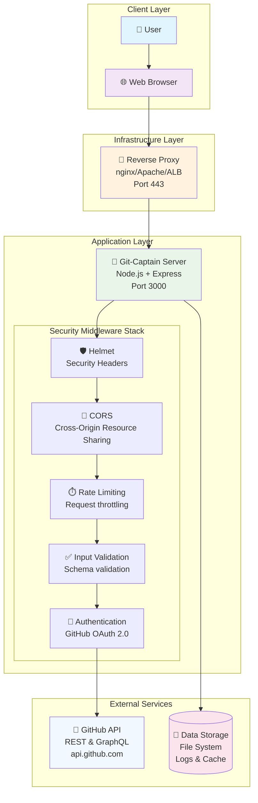

## 🔧 Error Handling & Recovery Architecture

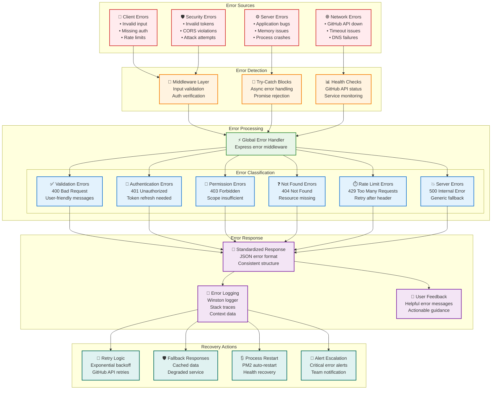

## 🔄 Request Flow Diagram

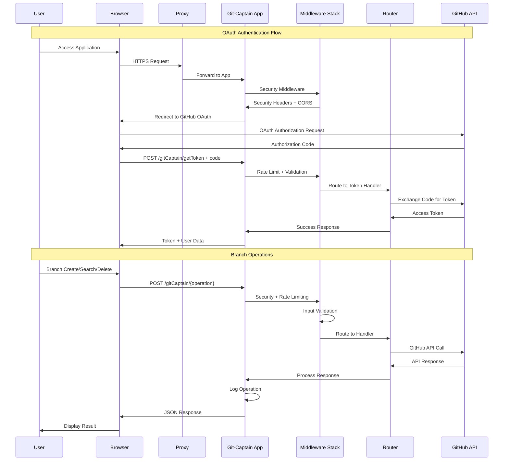

## 🏢 Component Architecture

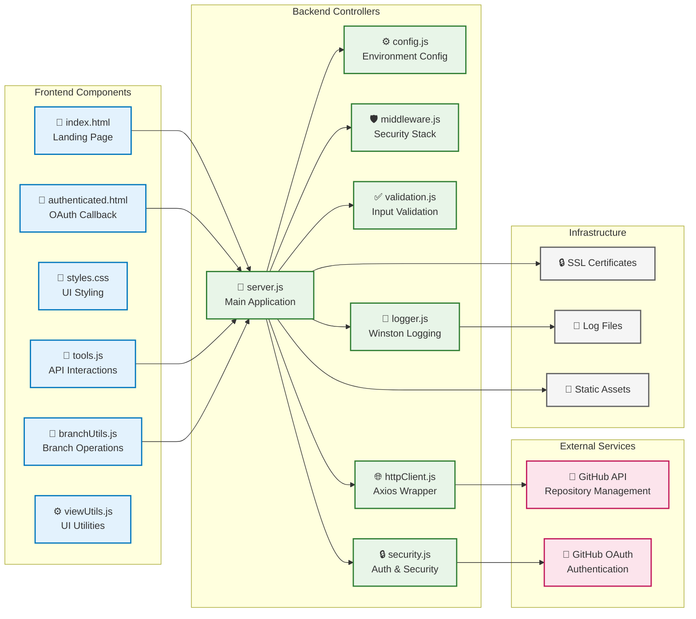

## 🔧 Technology Stack

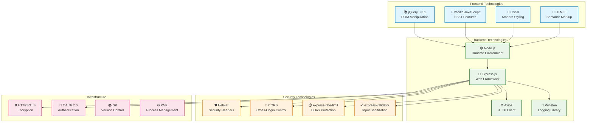

## 🔗 Data Flow & API Architecture

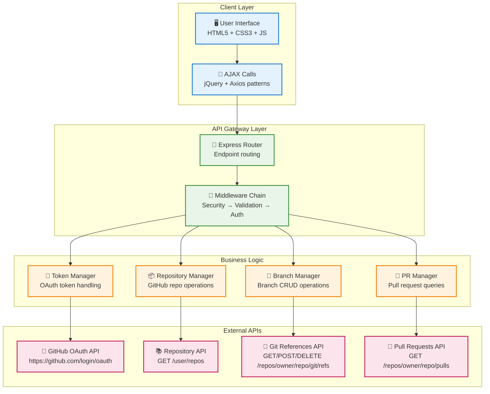

## 📋 API Endpoints Overview

| Endpoint | Method | Purpose | Rate Limit | Authentication |
|----------|--------|---------|------------|----------------|
| `/` | GET | Landing page | General | None |
| `/gitCaptain/getToken` | GET/POST | OAuth token exchange | Auth (300/5min) | OAuth code |
| `/authenticated.html` | GET | OAuth callback page | General | None |
| `/gitCaptain/createBranch` | POST | Create new branch | Auth (300/5min) | GitHub token |
| `/gitCaptain/searchForBranch` | POST | Search branches | Auth (300/5min) | GitHub token |
| `/gitCaptain/deleteBranch` | POST | Delete branch | Auth (300/5min) | GitHub token |
| `/gitCaptain/searchForRepos` | POST | Search repositories | Auth (300/5min) | GitHub token |
| `/static/*` | GET | Static assets | General | None |

## 🔒 Security Architecture

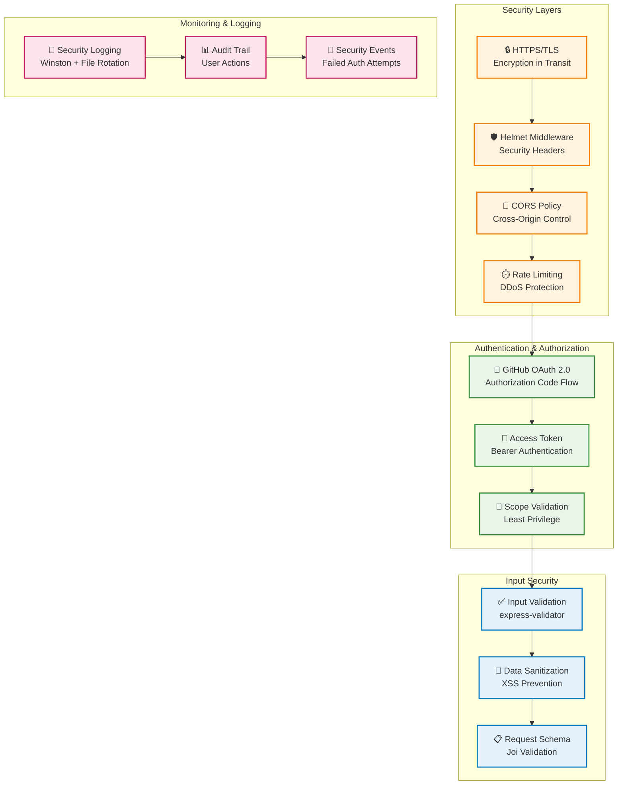

## 🗂️ Project Structure

```
Git-Captain/
├── 📁 controllers/                    # Backend Core
│   ├── 🔧 server.js                  # Main application server
│   ├── 🌐 httpClient.js              # Axios-based HTTP client
│   ├── 🛡️ middleware.js              # Security middleware stack
│   ├── ✅ validation.js              # Input validation schemas
│   ├── 📝 logger.js                  # Winston logging configuration
│   ├── ⚙️ config.js                  # Environment & app configuration
│   └── 🔒 security.js                # Security utilities
├── 📁 public/                        # Frontend Assets
│   ├── 📁 css/                       # Stylesheets
│   │   └── 🎨 styles.css            # Main UI styling
│   ├── 📁 js/                        # Client-side JavaScript
│   │   ├── 🔧 tools.js               # API interaction utilities
│   │   ├── 🌿 branchUtils.js         # Branch operation helpers
│   │   └── ⚙️ viewUtils.js           # UI manipulation utilities
│   ├── 📁 images/                    # Static images & favicon
│   └── 📁 views/                     # HTML templates
│       ├── 📄 index.html             # Landing page
│       └── 🔐 authenticated.html     # OAuth callback page
├── 📁 docs/                          # Documentation
│   ├── 📋 ARCHITECTURE.md            # System architecture (this file)
│   ├── 🚀 DEPLOYMENT.md              # Deployment guide
│   └── 🔒 SECURITY.md                # Security documentation
├── 📁 logs/                          # Application logs
│   ├── 📄 git-captain-YYYY-MM-DD.log # Daily application logs
│   └── 🚨 git-captain-errors-YYYY-MM-DD.log # Error logs
├── 📁 test/                          # Test suites
│   └── 🧪 security.test.js           # Security tests
├── 📁 scripts/                       # Utility scripts
│   └── ⚙️ setup.js                   # Environment setup
├── 🔐 .env                           # Environment variables
├── 📦 package.json                   # Node.js dependencies
├── 📋 MODULE_UPDATES.md              # Modernization changelog
├── 📖 README.md                      # Project overview
└── ⚙️ SETUP.md                       # Setup instructions
```

## 🔄 OAuth Flow Architecture

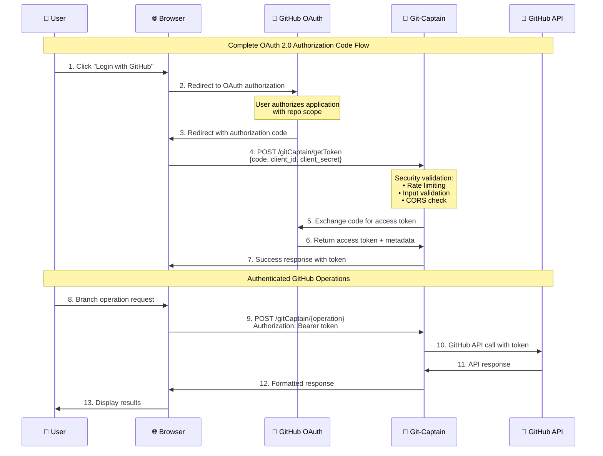

## 🛡️ Enhanced Security Flow

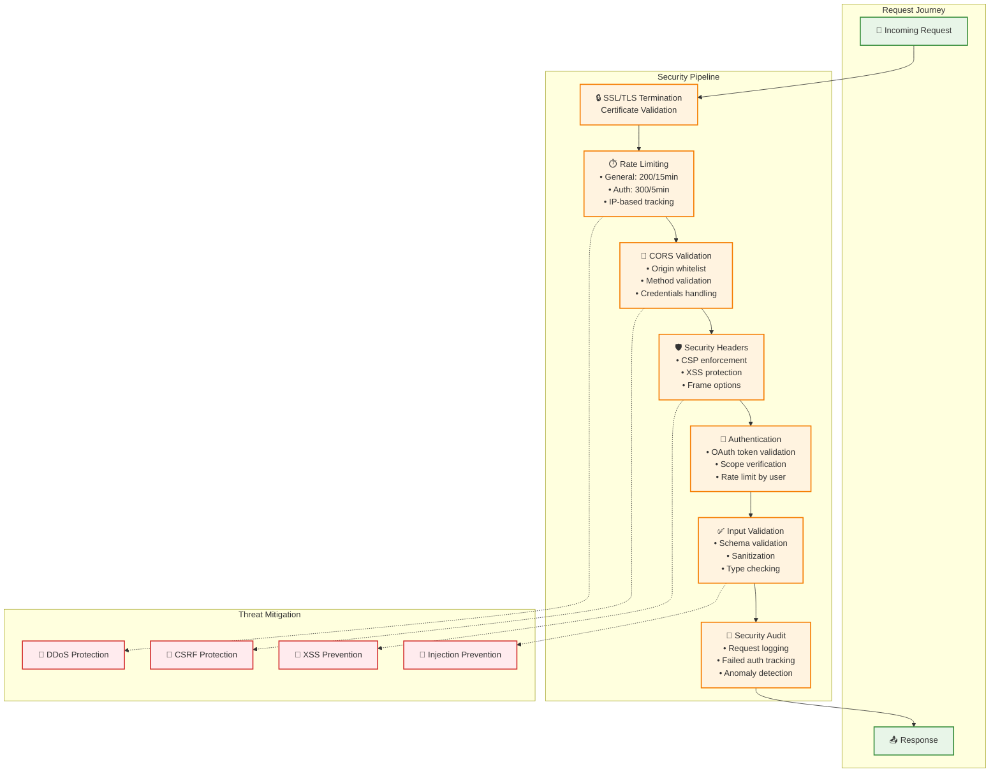

### Rate Limiting Strategy
- **General endpoints**: 200 requests per 15 minutes
- **Authenticated endpoints**: 300 requests per 5 minutes  
- **Static assets**: Unlimited (served efficiently)

### Caching Strategy
- Static assets served with appropriate cache headers
- GitHub API responses cached temporarily to reduce API calls
- SSL termination at reverse proxy level for performance

### Scalability Design
- Stateless application design for horizontal scaling
- Session data stored in GitHub tokens (no server-side sessions)
- Logging designed for distributed environments
- Process management ready (PM2 compatible)

## 🔧 Configuration Management

### Environment Variables (.env)
```bash
# Server Configuration
HTTPS_PORT=3000
HTTP_PORT=3001

# GitHub OAuth
GITHUB_CLIENT_ID=your_client_id
GITHUB_CLIENT_SECRET=your_client_secret
GITHUB_CALLBACK_URL=https://yourdomain.com/authenticated.html

# Application Settings
ORG_NAME=your-github-org
REPO_NAME=your-repo-name

# Security
SSL_KEY_PATH=./controllers/theKey.key
SSL_CERT_PATH=./controllers/theCert.cert

# Logging
LOG_LEVEL=info
LOG_MAX_SIZE=10m
LOG_MAX_FILES=14
```

### Runtime Configuration (config.js)
- Environment variable validation using Joi
- Default value fallbacks for development
- SSL certificate loading and validation
- GitHub API endpoint configuration

## 🚀 Deployment Architecture

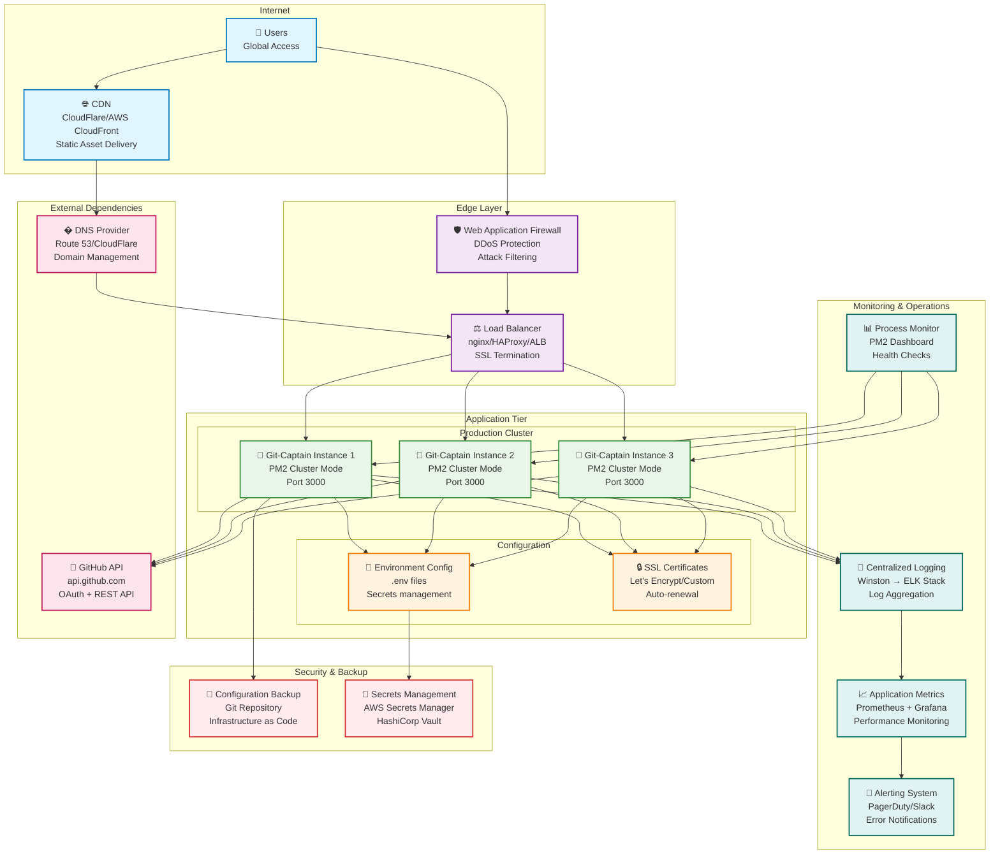

## 🧪 Testing Strategy

### Security Testing
- Input validation boundary testing
- Authentication bypass attempts  
- Rate limiting verification
- XSS and injection attack prevention

### Integration Testing  
- GitHub OAuth flow end-to-end
- API endpoint response validation
- Error handling and recovery
- SSL/TLS configuration verification

### Performance Testing
- Load testing with realistic user patterns
- Rate limit threshold validation
- Memory leak detection during extended runs
- GitHub API rate limit handling

## 📈 Monitoring & Observability

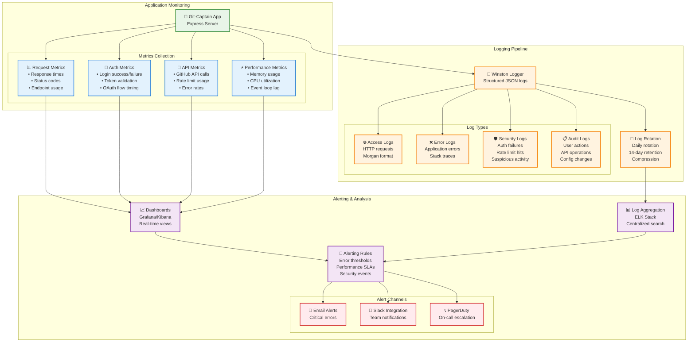

### Application Metrics
- Request count and response times
- Error rates by endpoint
- GitHub API usage and rate limits
- Authentication success/failure rates

### Infrastructure Metrics  
- CPU and memory utilization
- SSL certificate expiration monitoring
- Log file size and rotation health
- Process uptime and restart frequency

### Security Monitoring
- Failed authentication attempts
- Rate limit violations
- Suspicious request patterns
- SSL/TLS handshake failures

## 🔄 Maintenance & Updates

### Regular Maintenance Tasks
- **Weekly**: Review security logs for anomalies
- **Monthly**: Update Node.js dependencies (`npm audit` and `npm update`)
- **Quarterly**: SSL certificate renewal and validation
- **Annually**: Security audit and penetration testing

### Update Strategy
- Dependency updates tested in staging environment
- Gradual rollout with health check validation
- Rollback procedures documented and tested
- Security updates prioritized and expedited

## 📚 Related Documentation

- **[README.md](../README.md)** - Project overview and quick start
- **[SETUP.md](../SETUP.md)** - Detailed setup instructions  
- **[DEPLOYMENT.md](./DEPLOYMENT.md)** - Production deployment guide
- **[SECURITY.md](./SECURITY.md)** - Security best practices
- **[MODULE_UPDATES.md](../MODULE_UPDATES.md)** - Modernization changelog

---

*This architecture document represents Git-Captain v2.0 following the comprehensive modernization and security improvements completed in 2024.*
