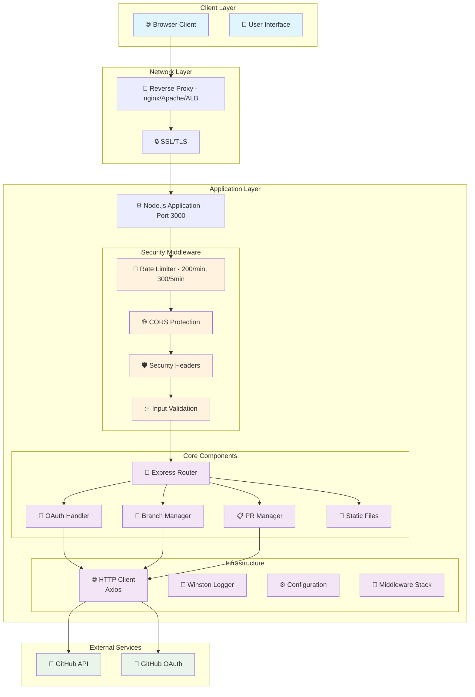
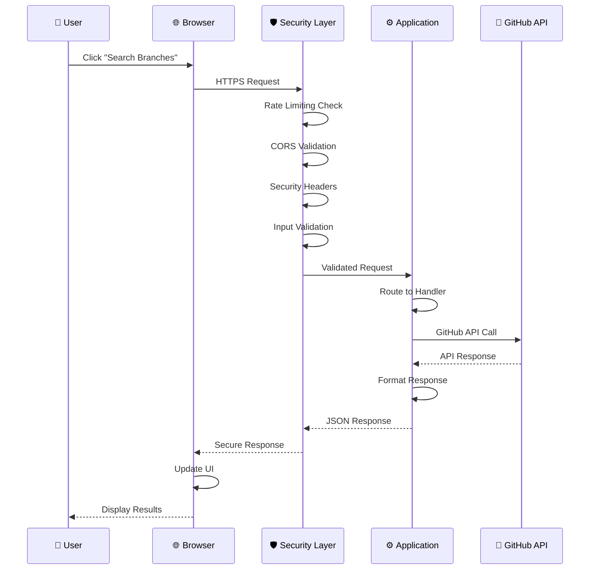
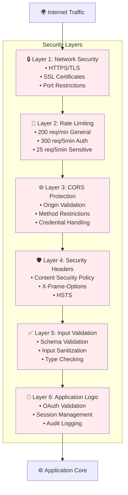
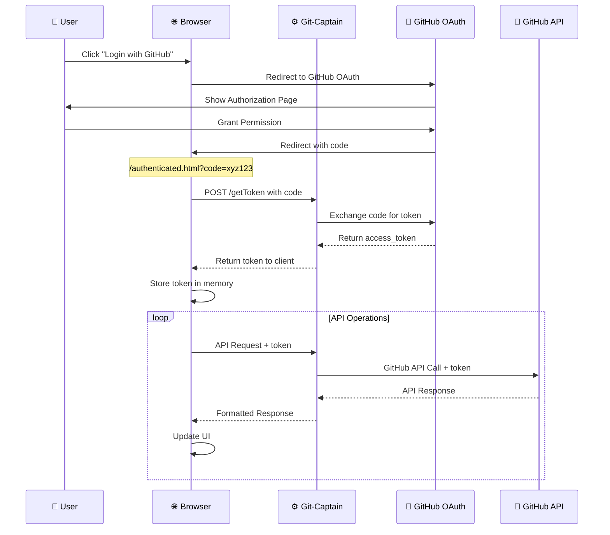
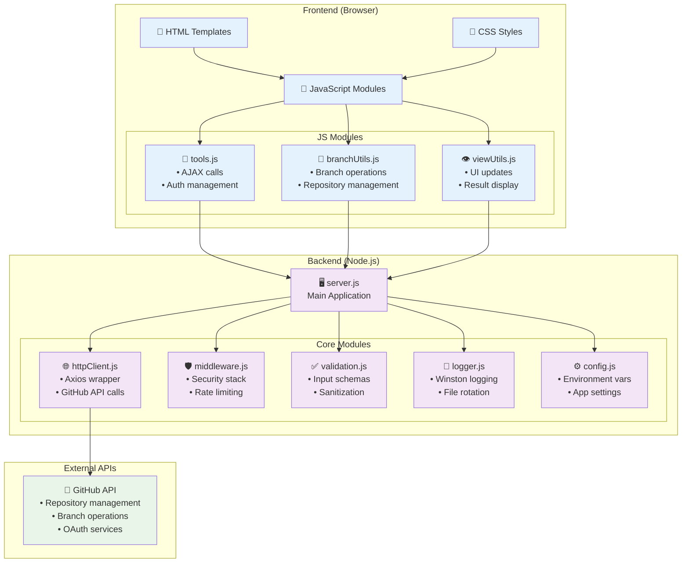
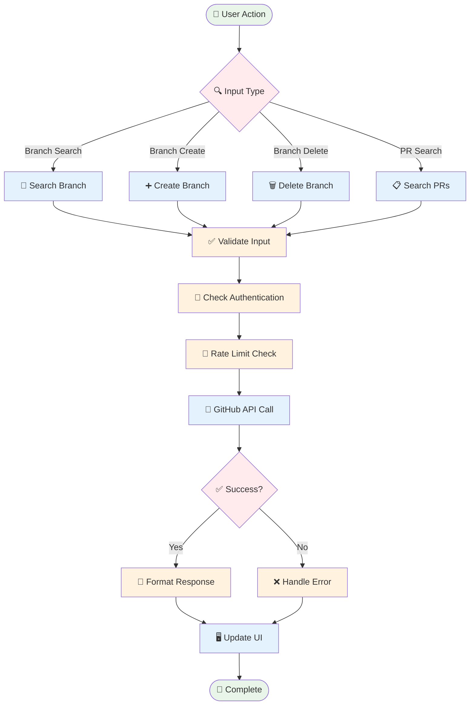

# Git-Captain v2.0 Architecture Diagrams

## 🏗️ High-Level System Architecture

## 🔄 Request Flow Architecture

## 🔒 Security Layer Architecture

## 🌐 OAuth 2.0 Flow

## 🗂️ Component Architecture

## 📊 Data Flow Diagram

## 💾 File System Structure

```mermaid
graph TD
    Root[📁 Git-Captain/] --> Controllers[📁 controllers/]
    Root --> Public[📁 public/]
    Root --> Docs[📁 docs/]
    Root --> Logs[📁 logs/]
    Root --> Config[📄 Config Files]
    
    Controllers --> Server[🔧 server.js]
    Controllers --> HTTP[🌐 httpClient.js]
    Controllers --> Mid[🛡️ middleware.js]
    Controllers --> Val[✅ validation.js]
    Controllers --> Log[📝 logger.js]
    Controllers --> Cfg[⚙️ config.js]
    Controllers --> Env[🔐 .env]
    Controllers --> SSL[🔑 SSL Certificates]
    
    Public --> CSS[📁 css/]
    Public --> JS[📁 js/]
    Public --> Images[📁 images/]
    Public --> Views[📁 views/]
    
    JS --> Tools[🔧 tools.js]
    JS --> Branch[🌿 branchUtils.js]
    JS --> ViewUtils[👁️ viewUtils.js]
    
    Views --> Index[🏠 index.html]
    Views --> Auth[🔐 authenticated.html]
    
    Docs --> Deploy[📖 DEPLOYMENT.md]
    Docs --> Arch[🏗️ ARCHITECTURE.md]
    
    Config --> Package[📦 package.json]
    Config --> README[📖 README.md]
    Config --> Setup[⚡ SETUP.md]
    Config --> Updates[📋 MODULE_UPDATES.md]
    
    classDef folder fill:#fff3e0
    classDef backend fill:#f3e5f5
    classDef frontend fill:#e3f2fd
    classDef docs fill:#e8f5e8
    classDef config fill:#ffebee
    
    class Root,Controllers,Public,Docs,Logs folder
    class Server,HTTP,Mid,Val,Log,Cfg,Env,SSL backend
    class CSS,JS,Images,Views,Tools,Branch,ViewUtils,Index,Auth frontend
    class Deploy,Arch docs
    class Config,Package,README,Setup,Updates config
```

---

## 🎯 Why Mermaid is Perfect for GitHub:

✅ **Native GitHub Support** - Renders automatically in README.md
✅ **Version Control Friendly** - Text-based, easy to diff
✅ **Professional Looking** - Clean, modern diagrams
✅ **Interactive** - Clickable elements (in some contexts)
✅ **Responsive** - Scales well on mobile
✅ **Easy to Maintain** - Update diagrams with simple text changes

You can copy any of these Mermaid diagrams directly into your README.md or documentation files, and they'll render beautifully on GitHub! 🚢
