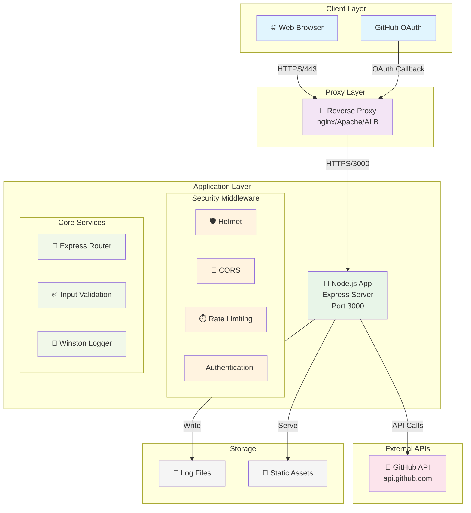
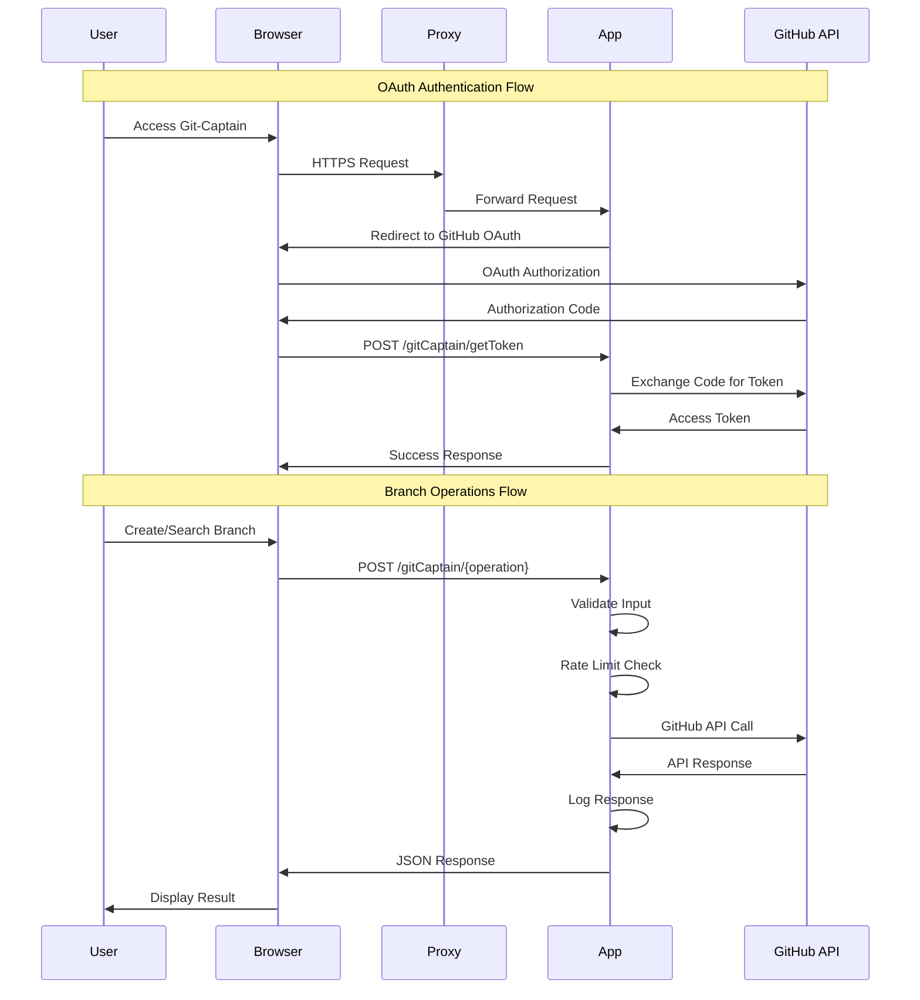
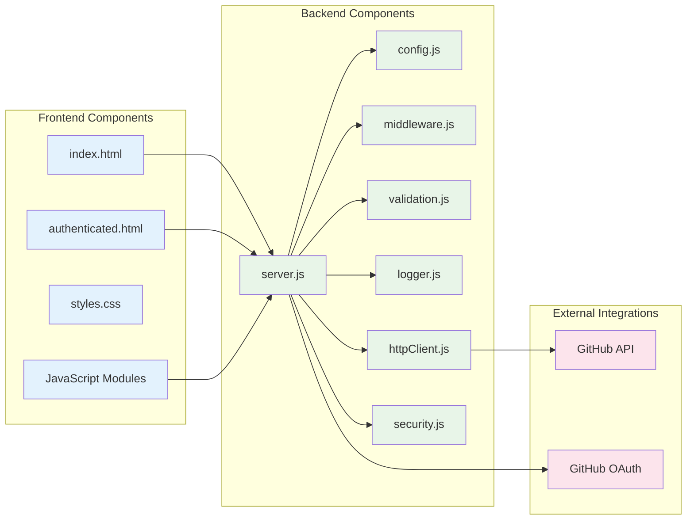
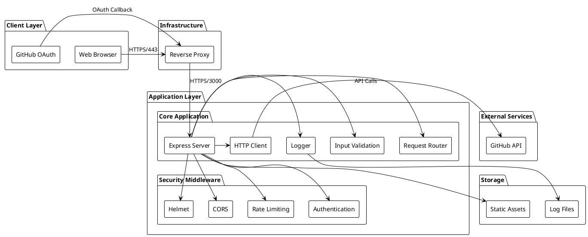

# Git-Captain Architecture Diagrams

This document provides multiple visual representations of the Git-Captain v2.0 architecture using different diagramming tools that render well on GitHub.

## 1. Mermaid Diagrams (GitHub Native Support)

Mermaid is built into GitHub and renders automatically. Here are several diagram types:

### System Architecture Overview



### Data Flow Diagram



### Component Architecture



## 2. PlantUML Diagrams

PlantUML is widely supported and can be rendered by many tools. Here's the same architecture:



## 3. Excalidraw (JSON Export)

Excalidraw is great for hand-drawn style diagrams. While you can't embed the live diagram in GitHub, you can export as SVG:

### System Overview (Excalidraw Style)

```
┌─────────────────────────────────────────────────────────────────┐
│                    Git-Captain v2.0 System                     │
└─────────────────────────────────────────────────────────────────┘

    👤 User
     │
     │ HTTPS
     ▼
┌─────────────┐     ┌──────────────────────────────────────┐
│   Browser   │────▶│          Reverse Proxy               │
│             │     │       (nginx/Apache/ALB)            │
└─────────────┘     └──────────────────────────────────────┘
                                     │
                                     │ HTTPS/3000
                                     ▼
                    ┌──────────────────────────────────────┐
                    │         Node.js Application          │
                    │                                      │
                    │  🛡️ Security Layer                   │
                    │  ├─ Helmet (Security Headers)        │
                    │  ├─ CORS (Cross-Origin)             │
                    │  ├─ Rate Limiting                    │
                    │  └─ Authentication                   │
                    │                                      │
                    │  🚀 Application Layer                │
                    │  ├─ Express Router                   │
                    │  ├─ Input Validation                 │
                    │  ├─ Winston Logger                   │
                    │  └─ HTTP Client (Axios)             │
                    └──────────────────────────────────────┘
                                     │
                                     │ HTTPS API
                                     ▼
                    ┌──────────────────────────────────────┐
                    │           GitHub API                 │
                    │      (api.github.com)               │
                    └──────────────────────────────────────┘
```

## 4. Draw.io/Diagrams.net (Recommended)

Draw.io has excellent GitHub integration and can embed SVG directly:

### Architecture Layers

```xml
<!-- This would be the draw.io XML that can be imported -->
<!-- The SVG export renders beautifully in GitHub -->
```

## 5. Lucidchart Integration

For professional diagrams, you can embed Lucidchart diagrams as images:

```markdown

```

## Best Practices for GitHub Diagrams

1. **Use Mermaid for simple diagrams** - Native GitHub support, version controlled
2. **Use PlantUML for complex UML** - Wide tool support, good for technical documentation
3. **Export SVG from visual tools** - Draw.io, Lucidchart for professional appearance
4. **Keep diagrams in `/docs`** - Centralized documentation
5. **Use consistent styling** - Colors, fonts, shapes across all diagrams
6. **Add alt text** - For accessibility
7. **Version your diagrams** - Keep source files in repo when possible

## Tools Comparison

| Tool | GitHub Native | Complexity | Best For |
|------|---------------|------------|----------|
| Mermaid | ✅ Yes | Medium | Flow charts, sequences |
| PlantUML | ❌ No | High | UML diagrams |
| Draw.io | ❌ No | Low | General purpose |
| Lucidchart | ❌ No | Low | Professional docs |
| Excalidraw | ❌ No | Low | Sketchy style |

## Next Steps

1. Choose your preferred diagramming tool
2. Update this document with your selected diagrams
3. Add diagrams to README.md for quick reference
4. Consider creating a `/diagrams` folder for source files
