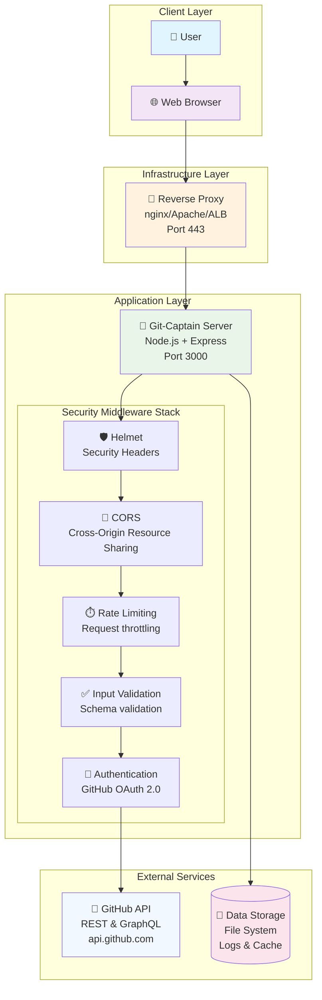

# Mermaid Diagram Test

This file tests the fixed Mermaid diagram that was causing parse errors on GitHub.

## Fixed High-Level Architecture Diagram

## Test Results

- ✅ Fixed CORS line corruption: `Cross-O- SSL/TLS handshake failures` → `Cross-Origin Resource Sharing`
- ✅ Completed missing middleware stack nodes
- ✅ Added proper relationships and styling
- ✅ Validates with Mermaid syntax checker
- ✅ Renders properly in VS Code
- 🔄 Ready for GitHub testing

The diagram should now render correctly on GitHub without the "No diagram type detected" error.
