# Mermaid Diagram Test

This file tests the fixed Mermaid diagram that was causing parse errors on GitHub.

## Fixed High-Level Architecture Diagram

```mermaid
graph TB
    subgraph "Client Layer"
        Browser[🌐 Web Browser]
        User[👤 User]
    end

    subgraph "Infrastructure Layer"
        Proxy[🔄 Reverse Proxy<br/>nginx/Apache/ALB<br/>Port 443]
    end

    subgraph "Application Layer"
        App[🚀 Git-Captain Server<br/>Node.js + Express<br/>Port 3000]
        
        subgraph "Security Middleware Stack"
            Helmet[🛡️ Helmet<br/>Security Headers]
            CORS[🔗 CORS<br/>Cross-Origin Resource Sharing]
            RateLimit[⏱️ Rate Limiting<br/>Request throttling]
            Validator[✅ Input Validation<br/>Schema validation]
            Auth[🔐 Authentication<br/>GitHub OAuth 2.0]
        end
    end

    subgraph "External Services"
        GitHub[🐙 GitHub API<br/>REST & GraphQL<br/>api.github.com]
        DB[(💾 Data Storage<br/>File System<br/>Logs & Cache)]
    end

    User --> Browser
    Browser --> Proxy
    Proxy --> App
    App --> Helmet
    Helmet --> CORS
    CORS --> RateLimit
    RateLimit --> Validator
    Validator --> Auth
    Auth --> GitHub
    App --> DB

    style User fill:#e1f5fe
    style Browser fill:#f3e5f5
    style Proxy fill:#fff3e0
    style App fill:#e8f5e8
    style GitHub fill:#f1f8ff
    style DB fill:#fce4ec
```

## Test Results

- ✅ Fixed CORS line corruption: `Cross-O- SSL/TLS handshake failures` → `Cross-Origin Resource Sharing`
- ✅ Completed missing middleware stack nodes
- ✅ Added proper relationships and styling
- ✅ Validates with Mermaid syntax checker
- ✅ Renders properly in VS Code
- 🔄 Ready for GitHub testing

The diagram should now render correctly on GitHub without the "No diagram type detected" error.
