# Mermaid Test File

This file is for testing Mermaid diagram rendering in VS Code.

## Simple Test Diagram

## Component Test

```mermaid
graph LR
    Frontend[🌐 Frontend] --> Backend[⚙️ Backend]
    Backend --> Database[🗄️ Database]
    Backend --> API[📡 External API]
```

## Sequence Test

If these simple diagrams work, then the issue is with specific syntax in the complex diagrams.
